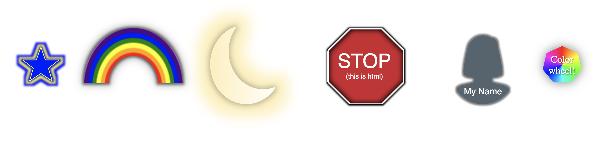

# Styled-Shapes

[](https://npmjs.org/package/styled-shapes)


[Styled-System](https://styled-system.com/) compatible shapes for use in your JSX



# Usage

`npm i styled-shapes`

```
import { Shape, star, hexagon } from 'styled-shapes';

const Star = () => <Shape path={star}/>;
const CustomShape = () => <Shape path="M 0,0 1,0, 1,1, 0,1 Z"/>;
const ShapeWithBordersAndShadow = () => <Shape path={hexagon} border="1px solid black" boxShadow="0 0 .5em rgba(0,0,0,.5)"/>;
```

# Notes

When `width` & `height` are not specified, `<Shape/>` will fit to fill a unit square (1em X 1em).

# Supported [Styled-System](https://styled-system.com/api) APIs

- Space
- Color
- Typography
- Layout
- Flexbox
- Background
- Border
- Shadow
- Grid(❓)

# Todo

- Unit tests
- Resize observer
- Animations / Transitions
- Border Style
- More Cross browser testing (cough IE cough)

# Bugs

- Some path elements (bezier curves, arcs), leave artifacts.
- At a large font size, artifacts between svg strokes appear. Checkout the [stroke-position](https://www.w3.org/Graphics/SVG/WG/wiki/Proposals/Stroke_position) proposal.

# License

MIT
